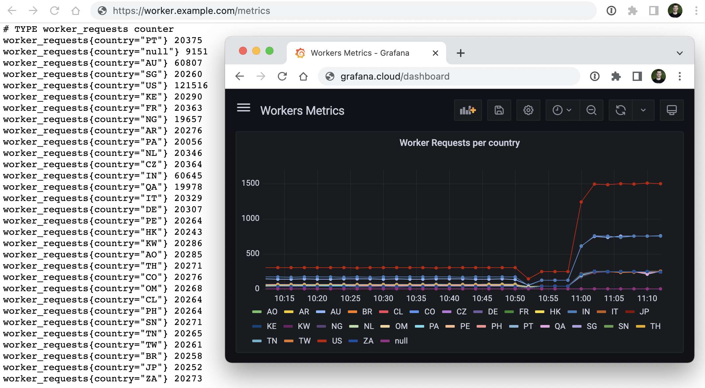

# Serverless Prometheus (aggregated) Push Gateway

A simple Prometheus _(aggregated)_ push gateway allowing stateless/serverless workloads, ephemeral and batch jobs to easily expose their metrics. Aggregated metrics are exposed via `/metrics` endpoint and optionally pushed to a remote Prometheus instance.

Powered by [Cloudflare Workers](https://workers.cloudflare.com/), [Durable Objects](https://developers.cloudflare.com/workers/learning/using-durable-objects), and [CRON Triggers](https://developers.cloudflare.com/workers/platform/cron-triggers).



## Features

- **Simple PATCH counter** - no need for a client libraries for a counter metric, just send `PATCH /metrics/:metricName?label1=value1&label2=value2` to increment its value.
- **Aggregated metrics** - received values are added up to the current (label matching) metrics. All metrics exposed on `GET /metrics`.
- **Automatic push to a remote prometheus server** - metrics are (optionally) pushed to a `remote_write` prometheus endpoint on each CRON Trigger execution. See [Grafana Cloud](https://grafana.com/products/cloud/features/#cloud-metrics) _(generous free tier)_ for a managed Prometheus with Grafana.

## Deployment

Cloudflare Account with Paid Workers is needed.

1. `yarn`
1. `yarn deploy`
1. `(optional)` add following secrets _(either via Cloudflare Dashboard or with `npx wrangler@beta secret put`)_
    - `SECRET_PROM_ENDPOINT` (e.g. `https://prometheus-us-central1.grafana.net/api/prom/push`)
    - `SECRET_PROM_USER` (e.g. 23333)
    - `SECRET_PROM_TOKEN` (e.g. xxyy)

## Send metrics

There are a couple of easy ways to push your metrics, the `POST /metrics` endpoint is compatible with any prometheus client library configured to use it as a push gateway.

In case Cloudflare Workers are the only clients, its recommended to deploy this Workers with no routes attached to it and use Service bindings.

1. `POST /metrics` - accepts [prometheus text-based format](https://prometheus.io/docs/instrumenting/exposition_formats/#text-based-format).
2. `PATCH /metrics/:metricName?label1=value1&label2=value2` - simplified counter increments that works well with no libraries needed.

### Examples

**curl**

1. Send curl 
    ```
    curl -x PATCH https://worker.example.com/metrics/metric_name?foo=bar
    ```
1. Send `POST` request with body in [prometheus text-based format](https://prometheus.io/docs/instrumenting/exposition_formats/#text-based-format)
    ```bash
    cat <<EOF | curl --data-binary @- https://worker.example.com/metrics
    # TYPE some_metric counter
    some_metric{label="val1"} 42
    # TYPE another_metric gauge
    # HELP another_metric Just an example.
    another_metric 2398.283
    EOF
    ```

**Workers**

1. A simple `worker_request` counter that will keep track of request countries. 
    ```js
    export default {
        async fetch(request, env, ctx) {
            ctx.waitUntil(
                fetch(`https://worker.example.com/metrics/worker_request?country=${request.cf.country}&anotherLabel=value`, {
                    method: "PATCH"
                })
            )
            return new Response("Hello World!")
        }
    }
    ```
1. [promjs](https://github.com/weaveworks/promjs) _(or any other js library)_
   ```js
    import prom from 'promjs';
    export default {
        async fetch(request, env, ctx) {
            const registry = prom()
            const counter = registry.create('counter', 'my_counter', 'A counter for things')
            
            // process tasks, e.g. orders
            counter.inc({user: "user1", plan: "pro"})
            counter.add(3, {user: "user2", plan: "free"})
            counter.inc({user: "user3", plan: "pro"})

            ctx.waitUntil(
                fetch(`https://worker.example.com/metrics`, {
                    method: "POST",
                    body: JSON.stringify(registry.metrics())
                })
            )

        }
    }
   ``` 

## Delete metrics

- `DELETE /metrics/__all` to delete all metrics
- `DELETE /metrics/:metricName` to delete a specific metric,
- `DELETE /metrics/:metricName?foo=bar` to delete a metric matching specific labels only _(all labels need to match)_

## Limitations

- Max ~100rps, as no Durable Objects sharding is in place. (TODO)
- `counter` and `gauge` metric types supported only. (`histogram` WIP)
- No auth. If a public route needed, Cloudflare Access is highly recommended.

## Thank you

Inspired by [Prometheus Push Gateway](https://github.com/prometheus/pushgateway) and [Prometheus Aggregation Gateway](https://github.com/weaveworks/prom-aggregation-gateway)
